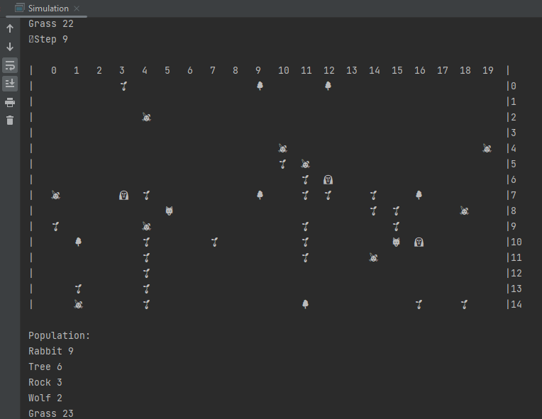
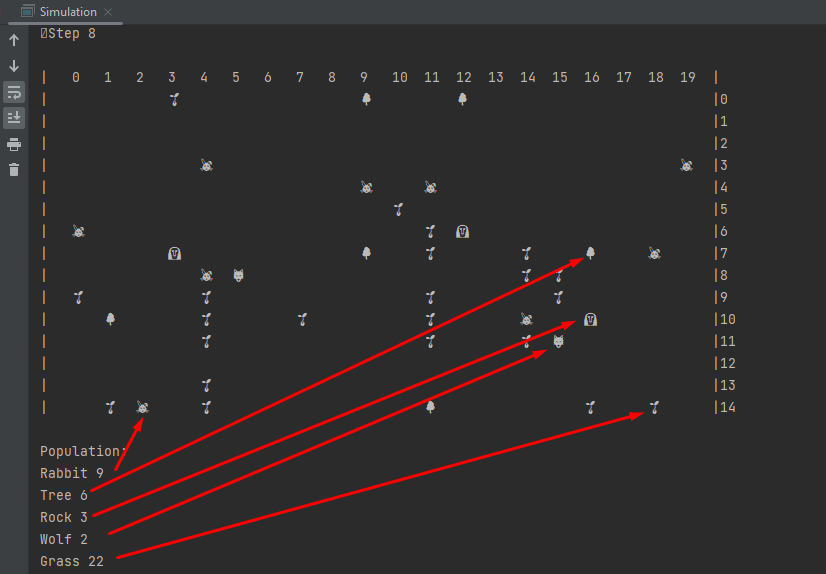

# Проект «Симуляция»
Пошаговая симуляция 2D мира, населённого травоядными(кролики) и хищниками(волки). 
Кроме существ, мир содержит статичные объекты. Cо статичными объектами, не являющимися ресурсами, существа не взаимодействуют. Виды статичных объектов: камень, дерево, трава. Трава - ресурс, которым питаются травоядные.

Приложение написано на языке Java в ООП-стиле. В поиске пути используется алгоритм поиска в ширину.
Техническое задание проекта: [https://zhukovsd.github.io/java-backend-learning-course/Projects/Simulation/](https://zhukovsd.github.io/java-backend-learning-course/Projects/Simulation/)

Правила:
* Хищники ищут травоядных, сближаясь с ними на дистанцию атаки(у волков 2 клетки) – атакуют;
* Если у травоядного после атаки хищником закончилось здоровье, хищник его съедает.
* У травоядных есть запас здоровья, у хищников – наносимый урон;
* Травоядные ищут траву, сближаясь с ней – мгновенно съедают, но перед хищниками – они беззащитны;
* Трава добавляет травоядному некоторое количество здоровья;
* У зверей есть скорость (сколько клеток они могут пройти за 1 итерацию). У созданных классов Wolf и Rabbit равна 1;
* Симуляция завершается в случае если ни одно существо не сдвинулось с места. Для этого должны погибнуть и не отреспауниться травоядные
* С вероятностью ~1/15 на карте респаунятся травоядные.
* Каждую итерацию респаунится трава.

При запуске метода main класса Simulation в IDEA, приложение выглядит так:

На следующем скрине стрелками отображены соответстия emoji типам существ, ресурсов, статичных объектов

## **Рекомендуется** запускать метод main класса Simulation в IDEA

## Для билда без IDEA:
    откройте терминал
    перейдите в папку pet_2_simulation
    скомпилируйте программу
    javac  src/main/java/com/dmitryboz/*.java src/main/java/com/dmitryboz/*/*.java  src/main/java/com/dmitryboz/*/*/*.java -d dist/classes -encoding UTF8
    jar -cvfm dist/simulation.jar src/main/java/META-INF/MANIFEST.MF -C dist/classes com/dmitryboz  
    запустите программу java -jar dist/simulation.jar
### Для запуска приложения вне IDEA нужен терминал с поддержкой emoji.

## Косяки, обнаруженные при самопроверке:
1) Заполнение карты “пустотами”
   * Применение hashMap в Map не оптимально. Записать null во все пустующие ячейки плохая идея.
   * Вместо проверки на null стоило использовать отсутствие ключа в hashMap 
   * Переписывать не стал всю, завязанную на этом логику. В будущем учту.
2) Есть небольшое дублирование в методе makeMove классов Herbivore и Predator и его можно было избежать. 
   * Переписывать не стал. В будущем учту.
3) Паузу/остановку не делал, ибо нужна многопоточность, её ещё не проходил по материалам роадмапа, решил идти последовательно. Пошаговый запуск не интересен. 
   * Если ни одно существо не сдвинулось, симуляция останавливается. Но ввиду регенерации пищи для травоядных и травоядных это маловероятно

